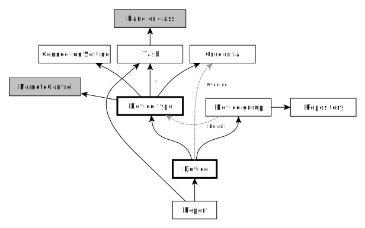

Architecture overview
=====================

A **device** has both a device group and a device type.

The **device group** is a logical group (like Firewall) and is imported
from a CMDB. It defines a default device type and constitutes the path
inside the repository where the config is stored (like
`repo/Firewalls/foo.txt`).

The **device type** specifies the actual hardware ("FortiGate" or
"Brocade").

Each device type is assigned to one or more tasks. Each task points to a
handler. The handler is defined in the code
(:mod:`configmaster.management.handlers`).

Some handlers use a :mod:`remote control class <utils.remote>`
which exports a high-level interface for communicating with a device.

The :class:`NetworkDeviceConfigBackupHandler <configmaster.management.handlers.config_backup.NetworkDeviceConfigBackupHandler>`
uses different remote control classes depending on the device type.

The  are designed to be
reusable outside of ConfigMaster.

During each
:mod:`run <configmaster.management.commands.run>`, ConfigMaster iterates over
all selected devices and runs all tasks which are defined for a device's
device type. Each tasks results in a **report** which stores the task's result
and output.

.. todo::
    In-depth description of the relationship between the different models.
